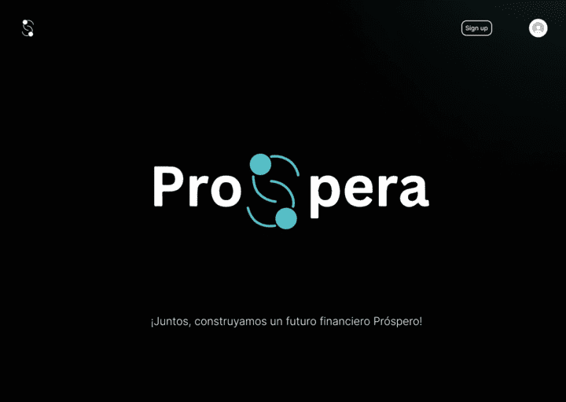

<section>
  
  <h1 align="center">Crowdfunding Prospera</h1>
</section>

# 🚀 Getting started app

This document will guide you through the steps required to deploy a Node.js application on a virtual private server (VPS) using Node.js 18+ and PM2. Starting with initialization in a development environment.
PM2 is a process manager that allows you to keep your application always running, even after the server restarts or crashes.

## Install dependencies

Install the dependencies with your package manager of choice:

```bash
yarn
# or
pnpm i ( this project use pnpm )
```

Then, custom scheme.prisma of project, later:

```bash
npx prisma generate
```

## Run the development server:

### `develop`

Start your application with autoReload enabled

```
pnpm run dev
# or
yarn dev
```

This app is running on [http://localhost:3000](http://localhost:3000) by default.
And require to be configured enviroment variables https://nextjs.org/docs/pages/building-your-application/configuring/environment-variables

## Deploy on a VPS:

### Prerequisites

    - Have access to a VPS with a Linux distribution installed (e.g. Ubuntu 22.04).
    - Node.js 18+ LTS installed on the server and port configurated.
    - Basic knowledge of command line and SSH
    - Access to your domain's DNS settings.
    - A domain name pointing to your VPS IP address.
    - A database installed on your VPS or 3rd party (e.g. MySQL, PostgreSQL).

### 📚 References

- [Node.js](https://nodejs.org/) – JavaScript runtime built on Chrome's V8 JavaScript engine.
- [PM2](https://pm2.keymetrics.io/) – Process manager for Node.js applications.
- [Nginx](https://www.nginx.com/) – Web server that can also be used as a reverse proxy, load balancer, mail proxy, and HTTP cache.
- [MySQL](https://www.mysql.com/) or [PosgreSQL](https://www.postgresql.org/) – Open-source relational database management system.

### 📚 Configure Environment .env

This project contain file: .env.example Find your variables your server

- DATABASE_URL
- SHADOW_DATABASE_URL (optional) more info: [Prisma-#shadow-database](https://www.prisma.io/docs/orm/prisma-migrate/understanding-prisma-migrate/shadow-database)
- NEXTAUTH_SECRET
- NEXTAUTH_URL
- GOOGLE_CLIENT_ID
- GOOGLE_CLIENT_SECRET
- ...

### 📚 Steps to deploy on a VPS

1.  **Connect to your VPS:**
    Use SSH to connect to your VPS. Replace `your_username` and `your_vps_ip` with your actual username and VPS IP address. e.g: `ssh your_username@your_vps_ip`
2.  **Update your system:**
    Run the following commands to update your system and install necessary dependencies:

    - `sudo apt update`
    - `sudo apt upgrade`
    - `sudo apt install curl`
    - `sudo apt install git`

3.  **Verifing Node.js version:**
    Run the following command to verify the Node.js version installed on your server:
    `node -v`.💡 If Node.js is not installed or the version is lower than 18, then install Node.js 18+.
4.  **Install PM2:**

    - Run the following command to install PM2 globally on your server:

      ```
      npm install pm2@latest -g
      ```

    - 💡 If you have a previous version of PM2 installed, you can update it using the command: `pm2 update`

5.  **Clone your repository:**
    Run the following command to clone your repository to your VPS: e.g.:

    - `git clone your_repository_ssh_url`

    Note: Replace `your_repository_ssh_url` with your actual repository URL using 🔗 SSH, for 🔒 security. For configuring SSH keys, you can follow the GitHub documentation: [Connecting to GitHub with SSH](https://docs.github.com/en/authentication/connecting-to-github-with-ssh)

6.  **Install dependencies:**
    Navigate to your project directory and install the dependencies using the following commands: e.g: `cd your_project_directory` (On the current production server the directory is: `/htdocs/prosperabo.com`)

    - exe: `yarn` or `pnpm install`

7.  **Configure your environment variables:**
    Create a `.env` file in your project directory and add your environment variables. You can use the `.env.example` file as a reference.
    💡 Remember to replace the placeholders with your actual values.
8.  **Build your project:**
    Run the following command to build your project:
    ```
     npx prisma generate
     pnpm run build
    ```
    It's recommended to build your project before starting it with PM2.
    💡 If you encounter any errors during the build process, make sure to fix them before proceeding.
9.  **Start your project with PM2:**
    Run the following command to start your project with PM2:
    ```
       pm2 start npm --name "your-app-name" -- start --port <your-port>
    ```
    💡 Replace `<your-port>` with the desired port number for your application.
10. **Verifing your project with pm2:**
    Run the following command to verify that your project is running with PM2:
    ```
      pm2 status
      pm2 list
      pm2 monit
      pm2 logs
    ```
    💡 If you see your project in the list, it means it's running successfully.

## Maintenance & Monitoring with PM2:

    Run the following command to monitor your project with PM2:

| ACTION                  | COMMAND            |
| ----------------------- | ------------------ |
| To view your app's logs | pm2 logs my-app    |
| To stop your app:       | pm2 stop my-app    |
| To restart your app:    | pm2 restart my-app |

More Information PM2: [https://pm2.io/docs/runtime/overview/]

## Frameworks:

- [Next.js](https://nextjs.org/) – React framework for building performant apps with the best developer experience
- [Auth.js](https://authjs.dev/) – Handle user authentication with ease with providers like Google, Twitter, GitHub, etc.
- [Prisma](https://www.prisma.io/) – Typescript-first ORM for Node.js

## UI

- [Tailwind CSS](https://tailwindcss.com/) – Utility-first CSS framework for rapid UI development
- [Radix](https://www.radix-ui.com/) – Primitives like modal, popover, etc. to build a stellar user experience
- [Framer Motion](https://framer.com/motion) – Motion library for React to animate components with ease
- [Lucide](https://lucide.dev/) – Beautifully simple, pixel-perfect icons
- [`next/font`](https://nextjs.org/docs/basic-features/font-optimization) – Optimize custom fonts and remove external network requests for improved performance
- [`ImageResponse`](https://nextjs.org/docs/app/api-reference/functions/image-response) – Generate dynamic Open Graph images at the edge.
- [`Shadcn`](https://ui.shadcn.com/) 🔨 Beautifully designed components that you can copy and paste into your apps. Accessible. Customizable. Open Source.

## Hooks and Utilities

- `useIntersectionObserver` –  React hook to observe when an element enters or leaves the viewport
- `useLocalStorage` – Persist data in the browser's local storage
- `useScroll` – React hook to observe scroll position
- `nFormatter` – Format numbers with suffixes like `1.2k` or `1.2M`
- `capitalize` – Capitalize the first letter of a string
- `truncate` – Truncate a string to a specified length
- [`use-debounce`](https://www.npmjs.com/package/use-debounce) – Debounce a function call / state update

## Code Quality

- [TypeScript](https://www.typescriptlang.org/) – Static type checker for end-to-end typesafety
- [Prettier](https://prettier.io/) – Opinionated code formatter for consistent code style
- [ESLint](https://eslint.org/) – Pluggable linter for Next.js and TypeScript

## Resources of planning and designing

- [Miro](https://miro.com/app/board/uXjVKP3RVyQ=/) – Online collaborative whiteboard for brainstorming and planning.
- [Figma](https://www.figma.com/design/kr919RBZKpOug7TYTUAXdN/Prospera?node-id=0%3A1&t=iF1OU5UBRoegtn2X-1) – Design and prototype your app with ease.
